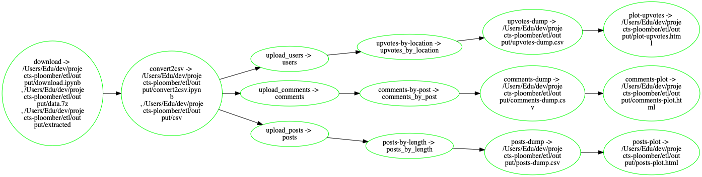

<!-- start header -->
To run this locally, [install Ploomber](https://docs.ploomber.io/en/latest/get-started/quick-start.html) and execute: `ploomber examples -n templates/etl`

[](https://binder.ploomber.io/v2/gh/ploomber/binder-env/main?urlpath=git-pull%3Frepo%3Dhttps%253A%252F%252Fgithub.com%252Fploomber%252Fprojects%26urlpath%3Dlab%252Ftree%252Fprojects%252Ftemplates/etl%252FREADME.ipynb%26branch%3Dmaster)

Questions? [Ask us on Slack.](https://ploomber.io/community/)

For a notebook version (with outputs) of this file, [click here](https://github.com/ploomber/projects/blob/master/templates/etl/README.ipynb)
<!-- end header -->


# ETL SQL pipeline

<!-- start description -->
Download a data file, upload it to a database, process it, and plot with Python and R.
<!-- end description -->

**Note:** This pipeline requires the `p7zip` package. It is installed if using `conda` (`environment.yml`). If using `pip`, you must install it yourself.

## Data

Subset of the [Stack Exchange dataset](https://archive.org/details/stackexchange).
It gets the data from the original source, converts it from XML to CSV, uploads it to a database, aggregates it, dumps it and generates a few plots. See the diagram below (generated using `ploomber plot`):



The ``pipeline.yaml`` file contains a few comments to understand what's going on at each step.


## Build

```sh
ploomber build
```

Output stored in the ``output/`` directory.
