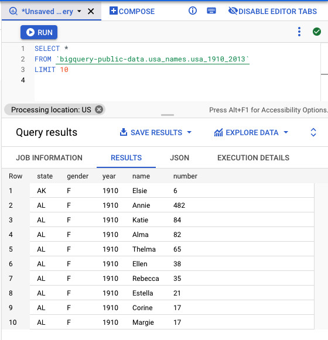
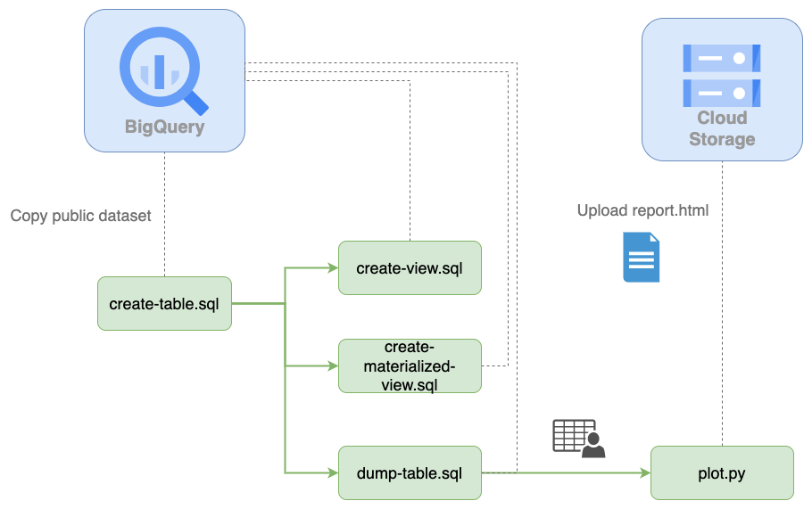
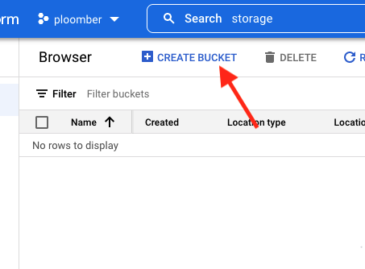
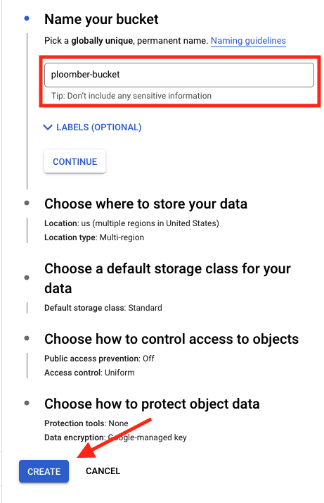
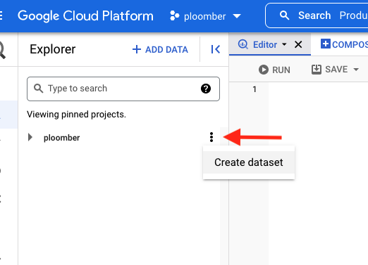
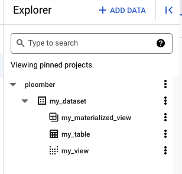
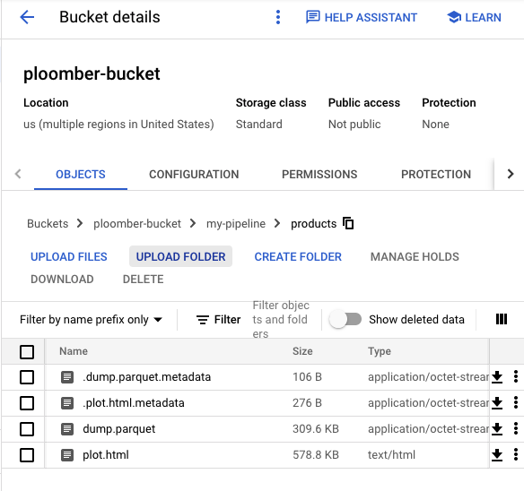
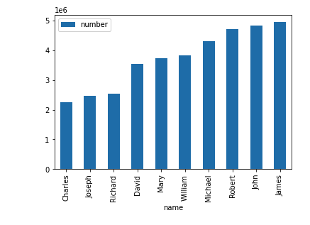

<!-- start header -->
To run this example locally, [install Ploomber](https://docs.ploomber.io/en/latest/get-started/quick-start.html) and execute: `ploomber examples -n templates/google-cloud`

To start a free, hosted JupyterLab: [](https://mybinder.org/v2/gh/ploomber/binder-env/main?urlpath=git-pull%3Frepo%3Dhttps%253A%252F%252Fgithub.com%252Fploomber%252Fprojects%26urlpath%3Dlab%252Ftree%252Fprojects%252Ftemplates/google-cloud%252FREADME.ipynb%26branch%3Dmaster)

Found an issue? [Let us know.](https://github.com/ploomber/projects/issues/new?title=templates/google-cloud%20issue)

Have questions? [Ask us anything on Slack.](https://ploomber.io/community/)

For a notebook version (with outputs) of this file, [click here](https://github.com/ploomber/projects/blob/master/templates/google-cloud/README.ipynb)
<!-- end header -->


# google-cloud

Note: this tutorial requires Ploomber 0.19.2 or higher.

This tutorial will show how you can use Google Cloud and Ploomber to develop a scalable and production-ready pipeline.

We'll use Google BigQuery (data warehouse) and Cloud Storage to show how we can transform big datasets with ease using SQL, plot the results with Python, and store the results in the cloud. Thanks to BigQuery scalability (we'll use a dataset with 5.5M records!) and Ploomber's convenience, **the entire process from importing the data to the summary report is on the cloud takes less than 20 seconds!**

# Introduction

Before we begin, I'll quickly go over two Google Cloud services we use for this project. [Google BigQuery](https://en.wikipedia.org/wiki/BigQuery) is a serverless data warehouse that allows us to analyze data at scale. In simpler terms, we can store massive datasets and query using SQL without managing servers. On the other hand, [Google Cloud Storage](https://en.wikipedia.org/wiki/Google_Cloud_Storage) is a storage service; it is the equivalent service to Amazon S3.

Since our analysis comprises SQL and Python, we use [Ploomber](https://github.com/ploomber/ploomber), an open-source framework to write maintainable pipelines. It abstracts all the details, so we focus on writing the SQL and Python scripts.

Finally, the data. We'll be using a public dataset that contains statistics of people's names in the US over time. The dataset contains 5.5M records. Here's what it looks like:



Let's now take a look at the pipeline's architecture!

# Architecture overview



The first step is the `create-table.sql` script; such script runs a `CREATE TABLE` statement to copy a public dataset. `create-view.sql` and `create-materialized-view.sql` use the existing table and generate a view and a materialized view (their purpose is to show how we can create other types of SQL relations, we don't use the outputs).

The `dump-table.sql` queries the existing table, and it dumps the results into a local file. Then, the `plot.py` Python script uses the local data file, generates a plot, and uploads it in HTML format to Cloud Storage. The whole process may seem intimidating, but Ploomber makes this straightforward!

Let's now configure the cloud services we'll use!

# Setup

We need to create a bucket in Cloud Storage and a dataset in BigQuery; the following sections explain how to do so.

## Cloud Storage

Go to the [Cloud Storage](https://console.cloud.google.com/storage) console (select a project or create a new one, if needed) and create a new bucket (you may use an existing one if you prefer so). In our case, we'll create a bucket "ploomber-bucket" under the project "ploomber":



Then, enter a name (in our case "ploomber-bucket"), and click on "CREATE":



Let's now configure BigQuery.

## BigQuery

Go to the [BigQuery](https://console.cloud.google.com/bigquery) console and create a dataset. To do so, click on the three stacked dots next to your project's name and then click on "Create dataset":



Now, enter "my_dataset" as the Dataset ID and "us" in *Data location* (location
is important since we'll be using a public dataset located in such region),
then click on "CREATE DATASET":


Google Cloud is ready now! Let's now configure our local environment.

## Local setup

First, let's authenticate so we can make API calls to Google Cloud. Ensure
you authenticate with an account that has enough permissions in the project
to use BigQuery and Cloud Storage:

<!-- #md -->
```sh
gcloud auth login
```
<!-- #endmd -->

If you have trouble, check [the docs.](https://cloud.google.com/sdk/gcloud/reference/auth)

Now, let's install Ploomber to get the code example:

<!-- #md -->
```sh
# note: this example requires ploomber 0.19.2 or higher
pip install ploomber --upgrade

# download example
ploomber examples -n templates/google-cloud -o gcloud

# move to the example folder
cd gcloud
```
<!-- #endmd -->

Let's now review the structure of the project.

# Project structure

* `pipeline.yaml` Pipeline declaration
* `clients.py` Functions to create BigQuery and Cloud Storage clients
* `requirements.txt` Python dependencies
* `sql/` SQL scripts (executed in BigQuery)
* `scripts/` Python scripts (executed locally, outputs uploaded to Cloud Storage)

You can look at the files in detail [here.](https://github.com/ploomber/projects/tree/master/templates/google-cloud) For this tutorial, I'll quickly mention a few crucial details.

`pipeline.yaml` is the central file in this project; Ploomber uses this file
to assemble your pipeline and run it, here's what it looks like:

<!-- #md -->
```yaml
# Content of pipeline.yaml
tasks:
  # NOTE: ensure all products match the dataset name you created
  - source: sql/create-table.sql
    product: [my_dataset, my_table, table]

  - source: sql/create-view.sql
    product: [my_dataset, my_view, view]

  - source: sql/create-materialized-view.sql
    product: [my_dataset, my_materialized_view, view]

  # dump data locally (and upload outputs to Cloud Storage)
  - source: sql/dump-table.sql
    product: products/dump.parquet
    chunksize: null

  # process data with Python (and upload outputs to Cloud Storage)
  - source: scripts/plot.py
    product: products/plot.html
```
<!-- #endmd -->

Each task in the `pipeline.yaml` file contains two elements: the source code
we want to execute and the product. You can see that we have a few SQL scripts
that generate tables and views. However, the `dump-table.sql` creates a
`.parquet` file. This indicates to Ploomber that it should download the results
instead of storing them on BigQuery. Finally, the `plot.py` script contains an
`.html` output; Ploomber will automatically run the script and store the
results in the HTML file.

You might be wondering how the order is determined. Ploomber extracts references
from the source code itself; for example, the `create-view.sql` depends on
`create-table.sql`. If we look at the code, we'll see the reference:

<!-- #md -->
```sql
# Content of sql/create-view.sql
DROP VIEW IF EXISTS {{ product }};
CREATE VIEW {{ product }} AS
SELECT *
FROM {{ upstream["create-table"] }}
```
<!-- #endmd -->

There is a placeholder `{{ upstream["create-table"] }}`, this indicates
that we should run `create-table.sql` first. At runtime, Ploomber will replace
the placeholder for the table name. We also have a second placeholder
`{{ product }}`, this will be replaced by the value in the `pipeline.yaml` file.

That's it for the `pipeline.yaml`. Let's review the `clients.py` file.

# Configure `clients.py`

`clients.py` contains a function that returns clients to communicate with
BigQuery and Cloud Storage.

For example, this is how we connect to BigQuery:

<!-- #md -->
```python
# Content of clients.py
def db():
    """Client to send queries to BigQuery
    """
    return DBAPIClient(connect, dict())
```
<!-- #endmd -->

Note that we're returning a `ploomber.clients.DBAPIClient` object. Ploomber
wraps BigQuery's connector, so it works with other databases.

Secondly, we configure the Cloud Storage client:

<!-- #md -->
```python
# Content of clients.py
def storage():
    """Client to upload files to Google Cloud Storage
    """
    # ensure your bucket_name matches
    return GCloudStorageClient(bucket_name='ploomber-bucket',
                               parent='my-pipeline')
```
<!-- #endmd -->

Here, we return a `ploomber.clients.GCloudStorageClient` object (ensure
that the `bucket_name` matches yours!)

Great, we're ready to run the pipeline!

# Running the pipeline

Ensure your terminal is open in the `gcloud ` folder and execute the following:

<!-- #md -->
```sh
# install dependencies
pip install -r requirements.txt

# run the pipeline
ploomber build
```
<!-- #endmd -->


After a few seconds of running the `ploomber build` command, you should see
something like this:

```txt
name                      Ran?      Elapsed (s)    Percentage
------------------------  ------  -------------  ------------
create-table              True          5.67999      30.1718
create-view               True          1.84277       9.78868
create-materialized-view  True          1.566         8.31852
dump-table                True          5.57417      29.6097
plot                      True          4.16257      22.1113
```

If you get an error, you most likely have a misconfiguration. Please send us a
[message on Slack](https://ploomber.io/community) so we can help you fix it!

If you open the [BigQuery](https://console.cloud.google.com/bigquery) console, you'll see the new tables and views:



In the [Cloud Storage](https://console.cloud.google.com/storage) console, you'll see the HTML report:



Finally, if you download and open the HTML file, you'll see the plot!



# Incremental builds

It may take a few iterations to get the final analysis. This process involves
making small changes to your code and rerunning the workflow. Ploomber can
keep track of source code changes to accelerate iterations, so it only
executes outdated scripts next time. Enabling this requires a bit of extra
configuration since Ploomber needs to store your pipeline's metadata, we
already pre-configured the same workflow, so it stores the metadata in a SQLite
database, you can run it with the following command:

<!-- #md -->
```sh
ploomber build --entry-point pipeline.incremental.yaml
```
<!-- #endmd -->

If you run the command another time, you'll see that it skips all tasks:

```txt
name                      Ran?      Elapsed (s)    Percentage
------------------------  ------  -------------  ------------
create-table              False               0             0
create-view               False               0             0
create-materialized-view  False               0             0
dump-table                False               0             0
plot                      False               0             0
```

Now try changing `plot.py` and rerun the pipeline; you'll see that it skips
most tasks!

# Closing remarks

This tutorial showed how to build maintainable and scalable data analysis pipelines on Google Cloud. Ploomber has many other features to simplify your
workflow such as parametrization (store outputs on a different each time you
run the pipeline), task parallelization, and even cloud execution (in case
you need more power to run your Python scripts!).

Check out our [documentation](https://docs.ploomber.io/) to learn more, and don't hesitate to [send us any questions!](https://ploomber.io/community)